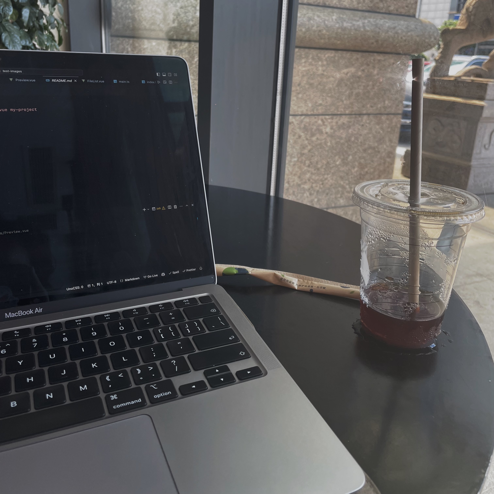
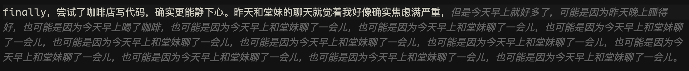

昨天和堂妹见了个面；

然后因为我的神奇作息她喝了两杯咖啡...

然后因为我的神奇作息今早咱两都醒着...

然后早 7 相约咖啡店...

 

finally，尝试了咖啡店写代码，总结就是比家里更能静下心。去的办公楼下的瑞幸不是星巴克，这个时间点多是急急忙忙的早 8 人，嘈杂的声音像白噪音一样，甚至比潮汐还有用。

本来想聊聊焦虑这件事儿的，被 Copilot 的废话文学整乐了，然后我神奇的作息也开始攻击我了，就不聊了 🙄

写这推文的时候已经回到家了，因为困了... 所以也没在咖啡店待多久... 但我依旧觉着这是社恐人的一大步!!!!
